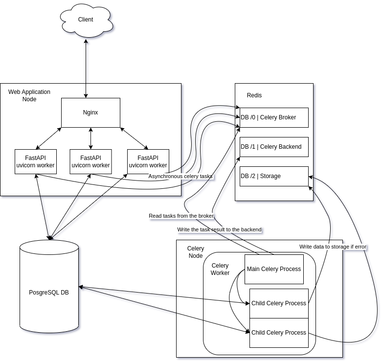

# text-and-summary
Store big texts and generate summaries.

## Run project on local machine where FastAPI uvicorn server and Celery worker run not in containers
[Tutorial how to start project text-and-summary backend on the local machine](./project-text-and-summary/README.md)

## Run project in containers
Project runs in three containers:
- Python 3.10 uvicorn/FastAPI container with preinstalled libs.\
Container without source code so can be uploaded to public Container Registry like DockerHub.\
Source code is attached with volumes.
- PostgresSQL DB container.
- Nginx Container.
- Redis container.\
 It is used by Celery as broker and backend.\
 As a storage of document ids for which summarization failed.
 - Python 3.10 Celery worker container with preinstalled libs.

1. Run the project in containers `cd <root derictory>` and `sh _assist/dev.sh app up`.
2. Open https://documents.localhost/docs. Because SSL certificates self-issued you will see the warning modal in the Browser \
so you will need to click “ADVANCED” and then the link provided to proceed to your host anyways.

## Architecure Diagram

